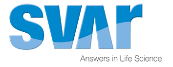
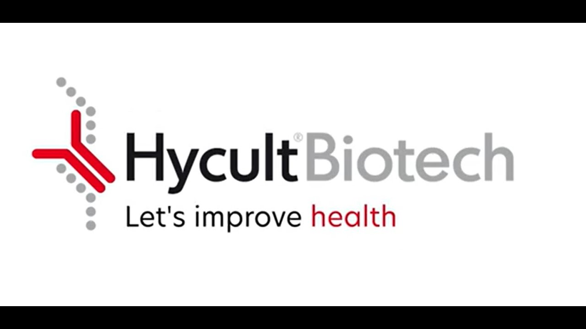
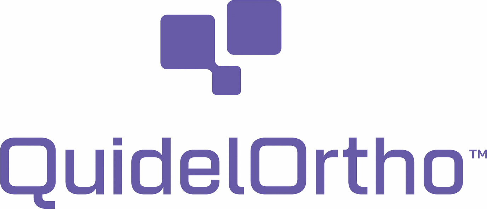
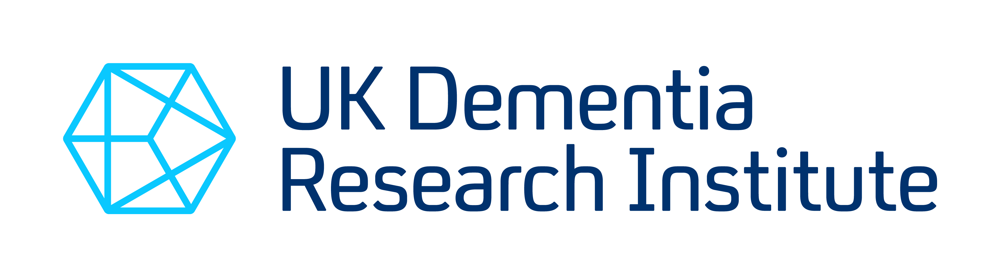

::: {.column-margin}

  Countdown to EMCHD 2026: 
  

  Registration & Abstracts 
  Now Open!

  📋 <a href="https://www.eventsforce.net/cbs/frontend/reg/thome.csp?pageID=178086&eventID=724&CSPCHD=000001000000RSsr5tSQVu$U89Ob73coFMT_0UIRlG1BnW0nXO" style="color:#00693E; font-weight:bold;">Register here</a> 
  📝 <a href="https://app.oxfordabstracts.com/auth?redirect=/stages/80645/submitter" style="color:#00693E; font-weight:bold;">Submit abstracts here</a> 
  ⏰ Abstract deadline: 30 April 2026

:::

# Join us in Cardiff for EMCHD 2026

We are delighted to welcome you to the **20th European Meeting on Complement in Human Disease (EMCHD26)**, taking place from **1st - 5th September 2026** in **Cardiff, Wales**.

This key meeting in the complement field will bring together researchers, clinicians, and industrial delegates from across the globe to explore new research findings in complement biology, including disease mechanisms, biomarker discovery and therapeutic innovations.  
Join us in Cardiff, the capital of Wales, for five days of science, collaboration, and vibrant discussions.

# Our Keynotes

We are excited to welcome world-class keynote speakers:

## Prof Siddharthan Chandran

:::: {.grid}
::: {.g-col-12 .g-col-md-6 .order-2 .order-md-1}
{.img-fluid width="250"}
:::

::: {.g-col-12 .g-col-md-6 .order-1 .order-md-2}
UK DRI Director, CEO  
University of Edinburgh, UK  
[https://www.ukdri.ac.uk/team/siddharthan-chandran](https://www.ukdri.ac.uk/team/siddharthan-chandran)
:::
::::

## Prof Menna Clatworthy

:::: {.grid}
::: {.g-col-12 .g-col-md-6 .order-2 .order-md-1}
{.img-fluid width="250"}
:::

::: {.g-col-12 .g-col-md-6 .order-1 .order-md-2}
University of Cambridge, UK  
[https://www.cardiovascular.cam.ac.uk/directory/menna-clatworthy](https://www.cardiovascular.cam.ac.uk/directory/menna-clatworthy)
:::
::::

## Prof V. Michael Holers

:::: {.grid}
::: {.g-col-12 .g-col-md-6 .order-2 .order-md-1}
{.img-fluid width="250"}
:::

::: {.g-col-12 .g-col-md-6 .order-1 .order-md-2}
University of Colorado, USA  
[https://som.cuanschutz.edu/Profiles/Faculty/Profile/4950](https://som.cuanschutz.edu/Profiles/Faculty/Profile/4950)
:::
::::

# Abstract Submission

Abstracts are submitted via **Oxford Abstracts**, and accepted abstracts, along with Invited Reviews, will be published in a Special Issue of **Clinical & Experimental Immunology (Wiley)**.

Abstract Submission is now open until the 30th of April 2026: [https://app.oxfordabstracts.com/auth?redirect=/stages/80645/submitter](https://app.oxfordabstracts.com/auth?redirect=/stages/80645/submitter)

# Registration

## Main Conference [1st – 5th Sep 2026]

Registration is now open here: [https://www.eventsforce.net](https://www.eventsforce.net/cbs/frontend/reg/thome.csp?pageID=178086&eventID=724&CSPCHD=000001000000RSsr5tSQVu$U89Ob73coFMT_0UIRlG1BnW0nXO)

## Satellite Symposium: Complement and the Brain [1st Sep 2026]

We are delighted to host a satellite symposium on 'Complement and the Brain', running in parallel with the Teaching Day (on Tuesday 1st September 2026). 
This symposium will focus on the emerging roles of complement in neuroinflammation and neurodegenerative diseases, with presentations ranging from fundamental mechanisms to therapeutic developments.

In the late afternoon of the satellite symposium the keynote will be delivered by Professor Siddharthan Chandran (Director, UK Dementia Research Institute), whose bench-to-bedside work has transformed our understanding of neurodegeneration.

We are grateful to the UK DRI for supporting this event. 

Registration is open to all (including those not attending the main conference).

## Social Excursions [4th Sep 2026, afternoon]

Enjoy the best of Welsh history and hospitality; options for trips will include:

- Cardiff Castle tour [https://www.cardiffcastle.com/](https://www.cardiffcastle.com/)
- National Museums of Wales Cardiff [https://museum.wales/cardiff/](https://museum.wales/cardiff/)
- St Fagans National Museum of History [https://museum.wales/stfagans/](https://museum.wales/stfagans/)
- City walking tour

All excursions will be available to select during registration on a first come, first served basis. For ECR social events, please see the ECR Activities tab.

## Interactive map of locations

<iframe width="100%" height="576" src="https://maphub.net/embed_h/vif0YthoOKyAwxmA?panel=1&panel_closed=1" frameborder="0"></iframe>

### We look forward to welcoming you

Cardiff is a dynamic capital city, rich in culture and history – the perfect setting to host our international complement community. 
We’re excited to welcome you to EMCHD2026 to share science, ideas, and a little Welsh hospitality.



# Our Sponsors

We thank our sponsors for their generous support in making this meeting possible.

## Gold Sponsors

[{fig-align="center"}](https://www.svarlifescience.com/)

## Silver Sponsors

[{fig-align="center"}](https://www.hycultbiotech.com/)

[{fig-align="center"}](https://www.quidelortho.com/)

## Satellite Symposium Sponsors

[{fig-align="center"}](https://www.ukdri.ac.uk/)
More to join! 

**See you in Cardiff!**

The EMCHD2026 Local Organising Committee

